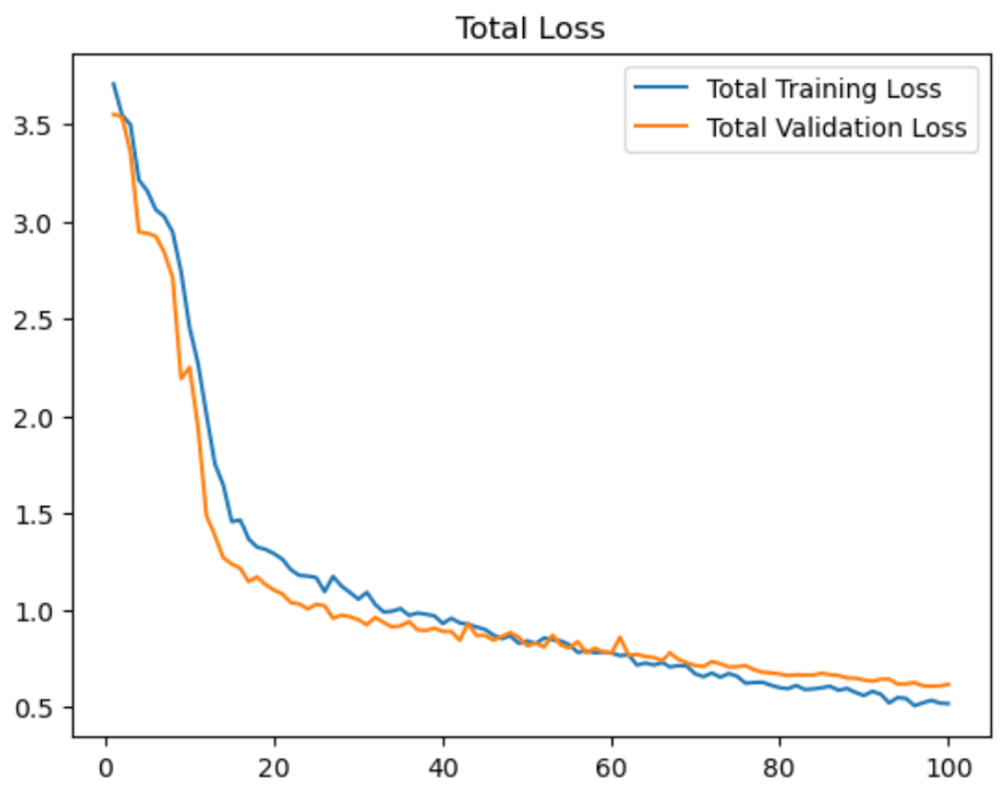
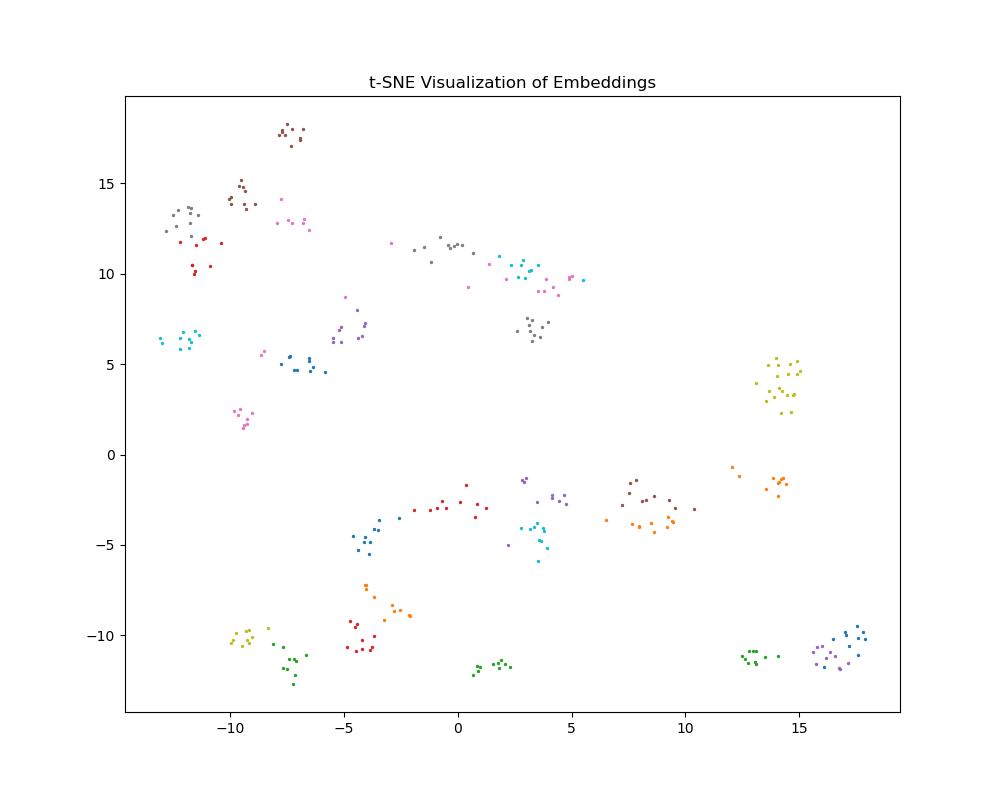
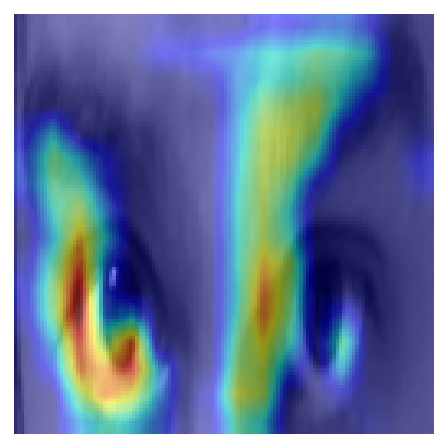
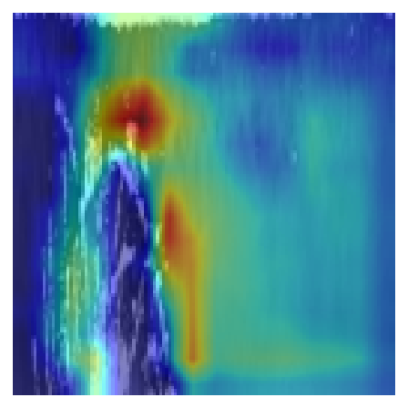
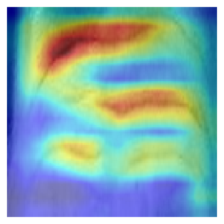

# Multi-Modal Biometric Fusion with Modified Prompt Tuning (MPT)

## Overview

This project implements a novel approach to multi-modal biometric recognition that combines **periocular**, **iris**, and **forehead crease** biometric traits using a single unified deep learning model with a transformer-based fusion mechanism.

### Goal
Create a single deep learning model that unifies three biometric modalities into one shared embedding space for efficient person identification.

### Challenge
Each biometric modality typically requires a separate model, making traditional systems complex and less scalable.

### Impact
This unified approach significantly simplifies biometric systems while enhancing robustness for real-world applications like security and authentication.

## Model Architecture


The architecture consists of three main components:

### 1. CNN Embedding Module
- Independent CNN networks for each modality (periocular, iris, forehead)
- ResNet-inspired convolutional neural networks with residual connections
- Batch normalization and depthwise convolutions for feature extraction
- Adaptive pooling for fixed-size embeddings regardless of input resolution

### 2. Fusion Transformer with Modified Prompt Tuning (MPT)
- Transformer encoder to capture cross-modal relationships
- **Modified Prompt Tuning (MPT)**: Learnable prompts that guide the fusion process
- Multi-head attention mechanism for effective modality interaction
- Positional encodings to preserve modality information

### 3. Joint Embedding Space
- Final embedding space where identities are well-separated
- Suitable for similarity-based matching and recognition
- Normalized embeddings for consistent cosine similarity matching

## Performance Highlights

| Metric | Value |
|--------|-------|
| Rank-1 Recognition Rate | 88.73% |
| Rank-2 Recognition Rate | 92.42% |
| Rank-5 Recognition Rate | 96.72% |
| Equal Error Rate (EER) | 5.43% |
| TPR @ 0.01 FPR | 80.80% |

## Dataset

- **Total Persons**: 247
- **Images per Person**: 10 poses x 3 modalities = 30 images
- **Total Images**: 7,410
- **Modalities**: Periocular, Iris, Forehead Creases
- **Resolution**: 128x128 pixels (grayscale)

## Key Features

- **Unified Embedding Space**: All three modalities are mapped to a single latent representation
- **Modality Fusion**: Effective cross-modal information integration using transformers
- **Prompt-Based Learning**: Novel use of learnable prompts to guide the fusion process
- **Robust Recognition**: High performance even with challenging pose variations
- **Efficient Architecture**: Shared backbone reduces model complexity

## Usage

### Training

```python
# Train the model with the provided Jupyter notebook
jupyter notebook train_mpt.ipynb
```

### Testing

```python
# Evaluate the model with the provided Jupyter notebook
jupyter notebook test_mpt.ipynb
```

### Inference Example

```python
import torch
from model.model_mpt import BiometricModel
from PIL import Image
import torchvision.transforms as transforms

# Load model
model = BiometricModel(embedding_dim=256)
model.load_state_dict(torch.load('model_latest_mpt_best.pt'))
model.eval()

# Prepare images
transform = transforms.Compose([
    transforms.Resize((128, 128)),
    transforms.ToTensor(),
    transforms.Normalize(mean=[0.5], std=[0.5])
])

# Load periocular, forehead, and iris images
periocular = transform(Image.open('path/to/periocular.png').convert('L')).unsqueeze(0)
forehead = transform(Image.open('path/to/forehead.png').convert('L')).unsqueeze(0)
iris = transform(Image.open('path/to/iris.png').convert('L')).unsqueeze(0)

# Extract embedding
with torch.no_grad():
    embedding = model(periocular, forehead, iris)
    
# Normalized embedding for similarity matching
embedding = torch.nn.functional.normalize(embedding, dim=1)
```

## Project Structure

```
biometric-fusion-transformer/
├── model/                       # Core model implementation
│   ├── model_mpt.py            # Main architecture with MPT
│   ├── dataset.py              # Dataset handler
│   ├── loss.py                 # Custom loss functions
│   └── architecture.svg        # Model architecture diagram
├── train_mpt.ipynb             # Training notebook
├── test_mpt.ipynb              # Testing and evaluation notebook
├── model_latest_mpt_best.pt    # Best trained model weights
├── embeddings_tsne.png         # t-SNE visualization of embeddings
├── roc_curve.png               # ROC curve performance
├── heatmaps/                   # Attention visualization heatmaps
└── dataset2/                   # Dataset directory
    ├── periocular/             # Periocular images
    ├── iris/                   # Iris images
    └── forehead/               # Forehead crease images
```

## Loss Functions

This project uses a combination of specialized loss functions:

1. **InfoNCE Loss**: Contrastive loss that pulls same-identity embeddings together while pushing different identities apart
2. **Contrastive Loss**: Classic loss function with margin for embedding space optimization



## Visualization

### t-SNE Embedding Visualization

The t-SNE visualization shows clear clustering of identities in the embedding space:



### Attention Heatmaps

We provide attention heatmaps showing which regions of each modality the model focuses on:

<div align="center">
  
  
  
</div>

